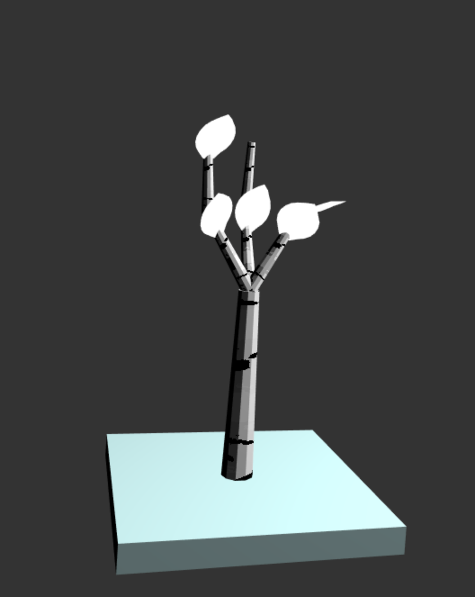
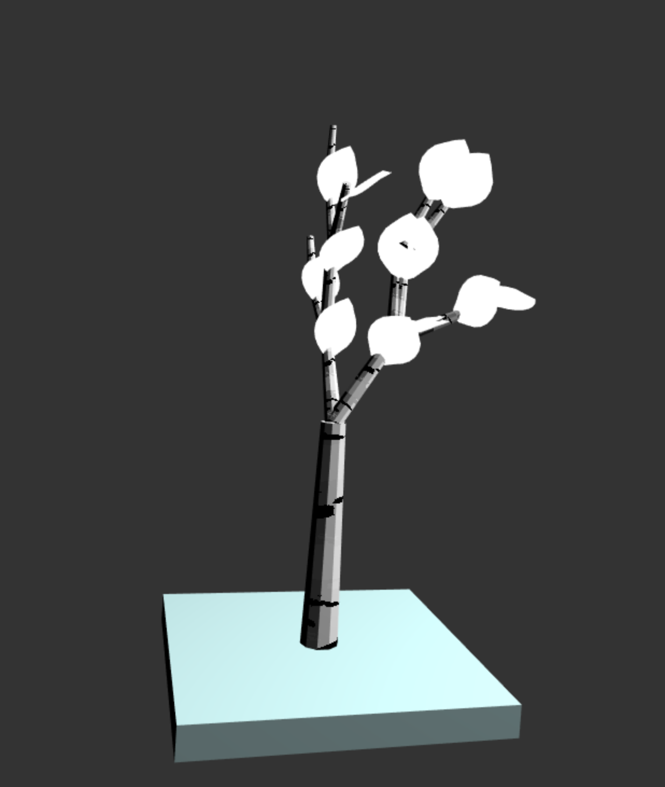
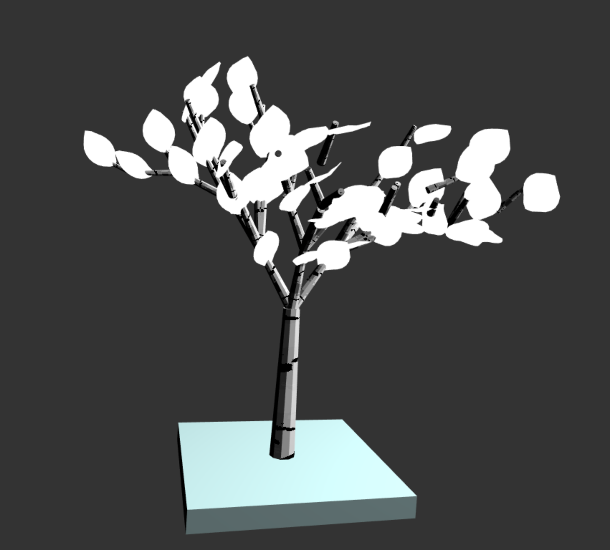

Kathryn Miller

Implementation:

In order to build my L-System I created a turtle class, a turtlestack class (just for ease of keeping track of turtles), a grammar class, and a Plant class which put my entire L-System together. The turtle class keeps track of its own position and orientation it is facing and is able to move along its orientation vector. I also currently have my turtle including a total rotation matrix as well as a totalTranslation matrix, both from different tactics I was trying in attempting to get my branches to rotate correctly (my turtle class is thus more verbose than it probably had to be because I struggled to get my rotations working). 

My plant class is what essentially put the tree together. I maintained arrays of final vbo data that I appended individual transformed branch or leaf data to. I obtained the individual branch and leaf data through use of this obj loader ->[https://github.com/frenchtoast747/webgl-obj-loader]. Each time I encountered a "b" in my grammar string, I would transform a branch by the turtles current position and orientation then move the turtle along the length of the scaled branch. Calculating the distance to move was easy since I had my default branch length set to 1, so the distance moved was always just the amount I scaled the branch by. Similarly, each time I encountered an "f", I would draw a leaf. All other grammar characters corresponded to modifications in my turtle's orientation and position. Once I was through the entire grammar I passed my final vbos to be drawn.

Grammar Rules: 

My grammar class simply had a dictionary of rules and expanded a given axiom. I chose my rules by drawing out the shape I wanted my birch tree to have. To create a trunk I made "t" just represent a branch drawn at a set scale of 1.5 and the character "t" just expanded to itself to guarantee that it would continually be passed down at the beginning of the grammar. The rest of my grammar rules were created with the intent of having each branch junction look roughly like this:
		|/
	   \|
		|

and then I just modified the rotation symbols of the intial rule to create variation. Although my rotations are set based on the input angle, I varied them by 5 degrees in each direction by choosing a random number r, multiplying it by 10 and subtracting 5. I then applied the modified random number to the input angle to get slight changes in rotation so that each branch didn't have the same exact angle.

The texture on the birch trees is done by inputing the branch's stretched uv coordinates to an fbm function. I then played around with values such that any point that generated an fbm value, f, above a certain threshold value would be drawn black. If you look closely there is also variation in the white part of the trunk but I had trouble getting it to look more like carved bark.

[]

[]

[]
